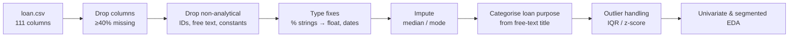

# 💳 Lending Club — Credit Risk Exploratory Data Analysis


> Cleaning and exploring **39,717 consumer loans** from Lending Club to understand which borrower and loan attributes are linked to **default ("Charged Off")** — the groundwork for a risk-based lending policy.

| Stat | Value |
|---|---|
| Loans analysed | 39,717 |
| Raw → cleaned columns | 111 → 44 |
| Fully Paid / Charged Off / Current | 32,950 / 5,627 / 1,140 |
| Default rate (closed loans) | **~14.6%** |

---

## 📌 Business Problem

Lending Club is a peer-to-peer lending marketplace. When it approves a loan it faces two risks:

- **Rejecting a good borrower** → lost interest income.
- **Approving a bad borrower** → credit loss when the loan is charged off.

The goal of this case study is to use **EDA** to find the **driving factors behind loan default**, so the company can reduce credit loss (e.g. by adjusting loan amount, interest rate or approval rules for risky profiles).

## 🔬 What Was Done



1. **Data-quality audit** – computed % missing per column; 54 of the 111 columns were completely empty. Columns with **≥40% nulls were dropped** (111 → 44).
2. **Type cleaning** – converted `int_rate` and `revol_util` from `"12.5%"` strings to numbers; parsed `issue_d`, `earliest_cr_line`, `last_pymnt_d` and `last_credit_pull_d` as dates.
3. **Imputation** – median for numeric columns (robust to skew), mode for categorical ones.
4. **Feature cleaning** – normalised the free-text loan `title` into four categories — **Debt Consolidation, Vehicle Loan, Home Improvement, Other** — after folding rare labels into the mode.
5. **Outliers** – compared z-score and **IQR** methods; `annual_inc` in particular is heavily right-skewed.
6. **Analysis** – distribution plots and segment comparisons of loan amount, interest rate, instalment, income and DTI by `loan_status`.

## 💡 Key Takeaways So Far

- Roughly **1 in 7 closed loans defaults**, so the dataset is imbalanced — rates matter more than raw counts.
- **Income and loan amount are highly skewed**; median-based imputation and IQR capping are needed before comparing groups.
- Loans with status **"Current"** (1,140) have no final outcome yet, so they should be kept out of default-rate calculations.

## 🔭 Next Steps

- Bivariate analysis of **default rate** vs. interest rate, grade, term, purpose, DTI and home ownership.
- Derive ratios such as **loan-to-income** and bucket continuous variables for clear, business-friendly charts.
- Summarise the top risk drivers into lending-policy recommendations.
- Build a baseline **probability-of-default** model (logistic regression) on top of this cleaned data.

## 🚀 How to Run

```bash
git clone https://github.com/AnishRane-cox/Leading_Club_case_study.git
cd Leading_Club_case_study
pip install pandas numpy matplotlib seaborn jupyter
jupyter notebook "Lenind Club.ipynb"
```

> ℹ️ One cell writes a summary file to a local Windows path — change it to a relative path (e.g. `value_counts_summary.txt`) before running.

## 📁 Repository Structure

```
├── Lenind Club.ipynb   # Data cleaning & EDA
├── loan.csv            # Lending Club loan data (2007–2011)
└── README.md
```

---

## 👤 Author

**Anish Rane** — Data & AI Engineer · MSc Machine Learning & AI (LJMU) · Mechanical Engineer

[](https://anishrane-cox.github.io/Portfolio/)
[](https://www.linkedin.com/in/anish-rane/)
[](https://github.com/AnishRane-cox)

⭐ If you found this useful, consider starring the repo.
